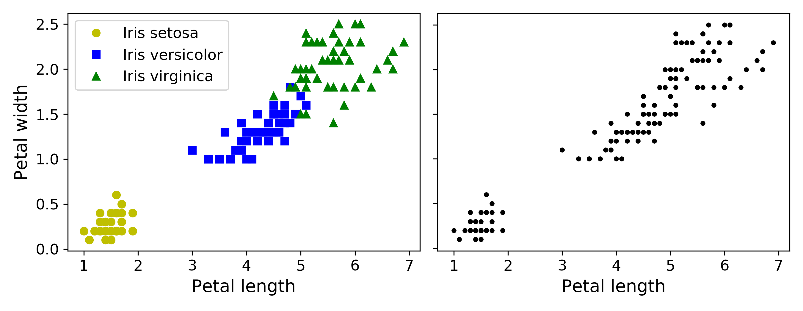
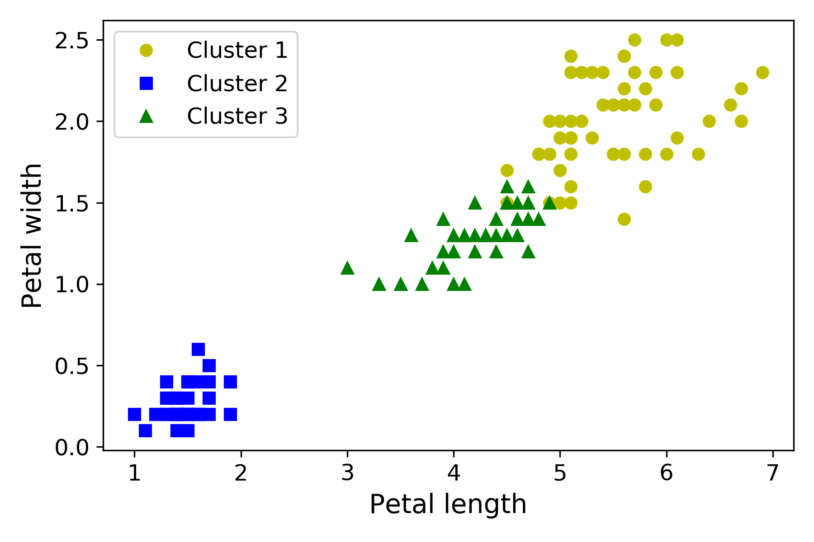
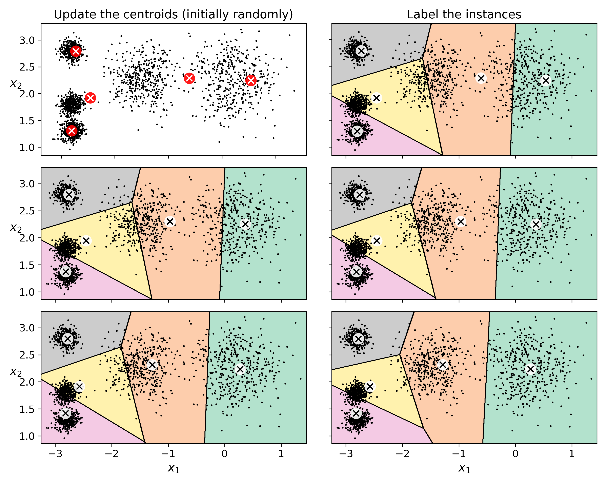
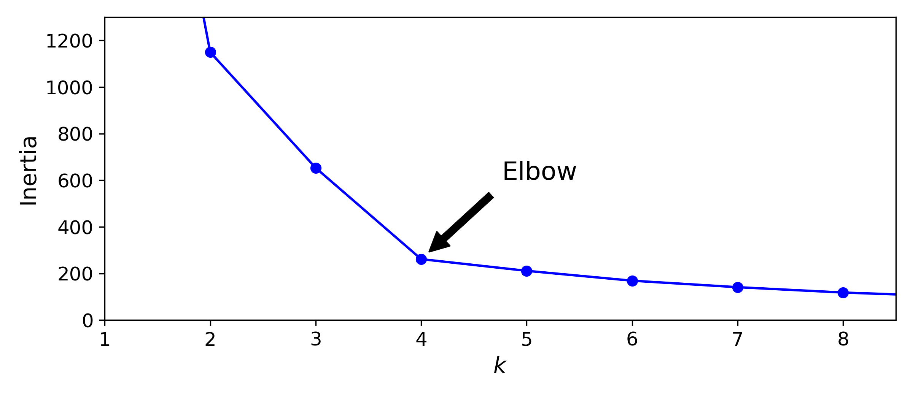
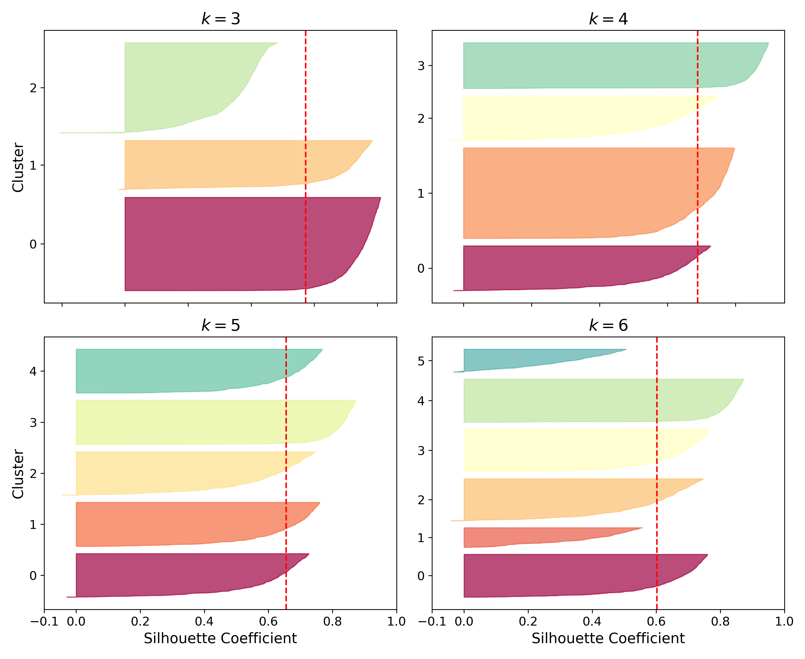
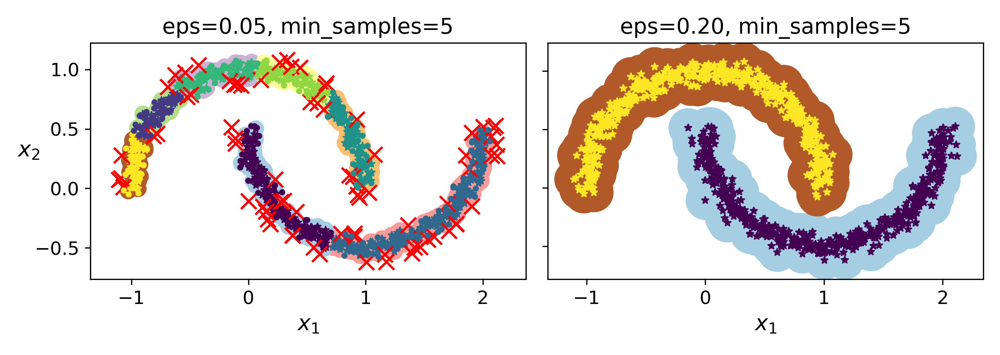
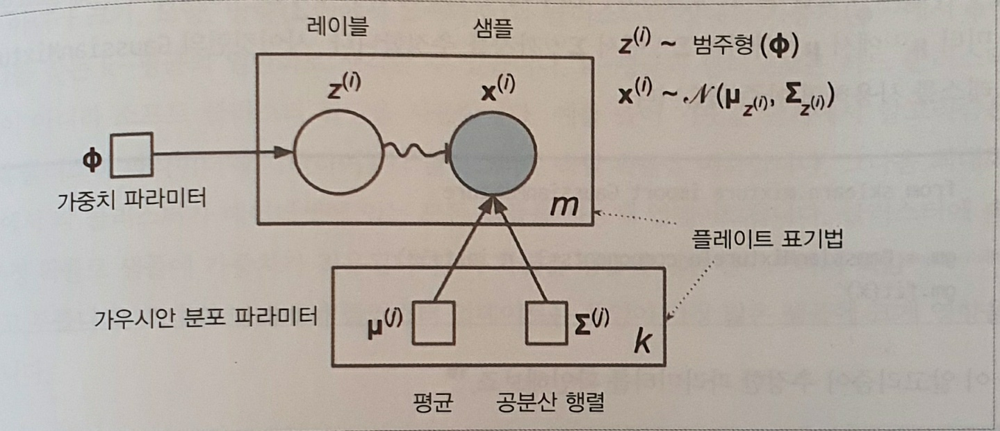
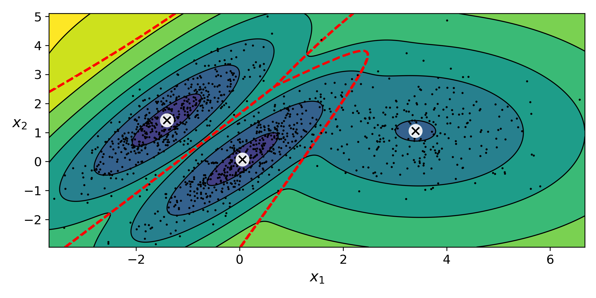
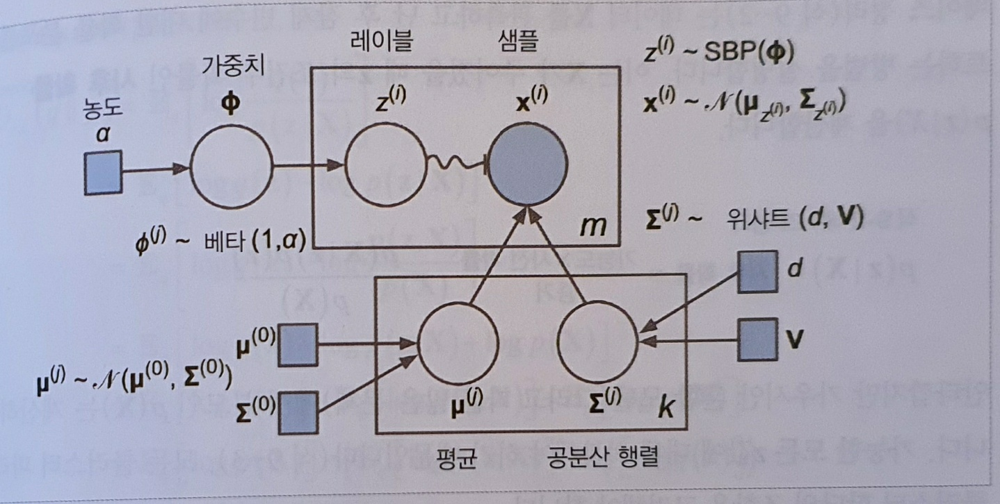

# 비지도 학습 
- 레이블이 없는 상태에서 학습을 하는 것.
- 이제 막 발을 담그기 시작한 분야 
- clustering, outtlier detection, density estimation에 쓰이곤 함.

## 예시




# K Means
K개의 클러스터로 만들기

1. 랜덤으로 센트로이드 할당
2. voronoi diagram 생성
3. 센트로이드 업테이트 
4. 2~3 반복 
(voronoi diagram: 평면을 특정 점까지의 거리가 가장 가까운 점의 집합으로 분할한 그림

`R={x in X | d(x, P_k) <= d(x, P_j) j!= k`

P_k = X의 모든 점들
)


## 평가
이녀셔 inertia: 각 샘플과 가장 가까운 센트로이드 사이의 평균 제곱 거리

## 특징
제한된 횟수 안에 수렴하지만 local optimum임. 매 실행시 다른 결과가 나올 수도 있다.

## KMeans sklearn
- 이레 논문에 사용된 알고리즘들이 KMeans에 기본값으로 구현되어 있음.
- K Means는 초기에 램덤하게 센트로이드를 지정하는 것이 중요하다. 이것을 다룬 논문이 2006 [KMeans++](http://ilpubs.stanford.edu:8090/778/1/2006-13.pdf)
    - KMeans++
        1. 무작위로 센트로이드 하나를 선택한다.
        2. 위에서 선택한 센트로이드에서 멀리 떨어진 센트로이드를 환률적으로 선택한다.
        3. 반복
- KMeans 알고리즘에서 불필요한 계산을 줄인 논문 2014 [Using the Triangle Inequality to Accelerate K-Means](https://www.researchgate.net/publication/2480121_Using_the_Triangle_Inequality_to_Accelerate_K-Means)
- 기계학습은 보통 큰 데이터셋으로 진행되기 떄문에 메모리 문제를 야기함. 미니배치로 학습하는 논문이 나옴. 2010 [Web-scale k-means clustering](https://dl.acm.org/doi/10.1145/1772690.1772862)

## K 찾기
- KMeans는 적절한 K를 알아야한다는 단점이 있다. 데이터가 N 차원이면 사실 알 수 없음
- 적당한 K를 찾는 방법으로 아래와 같은 방법이 있다.
1. Elbow
    - 이너셔가 낮으면 대체로 좋은 모델일 것이라고 추측
    - 이너셔 감소의 기울가 변하는 지점을 최적의 K로 본다.
    - 좋은 방법이 아닐때가 많다.

2. Silhouuette 계수
    - 클러스터에 데이터가 적절히 분포되었다면 좋은 모델일거라고 추측
    - 그래프의 너비: 클러스터가 가진 샘플의 갯수.
    - 그래프의 높이: 실루엣 계수 (샘플이 클러스터에 잘 속해 있는건 지를 판단하는 측정치)
    - 아래 예시에서는 클러스터가 적절히 분배되고 일정 실루엣 계수 이상을 가진 k=5가 가장 적합.


```python
        def fit(self, X, y=None, sample_weight=None):
            for seed in seeds:
                # run a k-means once
                labels, inertia, centers, n_iter_ = kmeans_single(
                    X, sample_weight, self.n_clusters,
                    max_iter=self.max_iter, init=init, verbose=self.verbose,
                    precompute_distances=precompute_distances, tol=tol,
                    x_squared_norms=x_squared_norms, random_state=seed)
                # determine if these results are the best so far
                if best_inertia is None or inertia < best_inertia:
                    best_labels = labels.copy()
                    best_centers = centers.copy()
                    best_inertia = inertia
                    best_n_iter = n_iter_
        ...
        
        if algorithm == "full":
            kmeans_single = _kmeans_single_lloyd
        
        def _kmeans_single_lloyd(X, sample_weight, n_clusters, max_iter=300,
                         init='k-means++', verbose=False, x_squared_norms=None,
                         random_state=None, tol=1e-4,
                         precompute_distances=True):
            ...
            # init
            centers = _init_centroids(X, n_clusters, init, random_state=random_state,
                              x_squared_norms=x_squared_norms)
            
            for i in range(max_iter):
                # labels assignment is also called the E-step of EM
                labels, inertia = _labels_inertia(X, sample_weight, x_squared_norms, centers,
                                precompute_distances=precompute_distances,
                                distances=distances)
                # computation of the means is also called the M-step of EM
                centers = _k_means._centers_dense(X, sample_weight, labels,
                                              n_clusters, distances)
            return
            
        def _init_centroids(X, k, init, random_state=None, x_squared_norms=None,
                    init_size=None):
            ...
            seeds = random_state.permutation(n_samples)[:k]
            centers = X[seeds]
```

# DBSCAN
- 클러스터링 알고리즘
- 밀집된 연속적 지역을 클러스터로 정의
- 샘플에서 엡실론 내에 샘플이 몇 개 있는지 셈. eposilon-neighborhood
- 같은 epsilon-neighborhood 는 같은 클러스터로 지정. 이웃의 이웃의 이웃도 같은 클러스터가 됨.
- 이 알고리즘은 예측기가 없음 (predict 메소드) -> 쓰고 싶다면 KNN의 K neighbors 사용해도 됨
- +알고리즘이 매우 간단
- +클러스터의 모양과 갯수에 상관 없이 클러스터를 찾을 수 있음.
- -클러스터간의 밀집도가 크게 다르면 성능이 떨어짐. 엡실론은 하나뿐이므로.
- 계산 복잡도, O(mlogm) 공간 복잡도 O(m^2)



```python
def fit(self, X, y=None, sample_weight=None):
    neighbors_model = NearestNeighbors(
            radius=self.eps, algorithm=self.algorithm,
            leaf_size=self.leaf_size, metric=self.metric,
            metric_params=self.metric_params, p=self.p, n_jobs=self.n_jobs)
    neighbors_model.fit(X)
    
    neighborhoods = neighbors_model.radius_neighbors(X, return_distance=False)
    n_neighbors = np.array([np.sum(sample_weight[neighbors])
                                    for neighbors in neighborhoods])
    
    core_samples = np.asarray(n_neighbors >= self.min_samples,
                                  dtype=np.uint8)
```

# GMM 가우시안 혼합 모델

- 샘플이 파라미터가 알려지지 않은 여러 개의 혼합된 가우시안 분포에서 생성되었다고 가정하는 확률 모델.

- 데이터셋 X가 다음 확률 과정을 통해 생성되었다고 가정함.
1. 샘플마다 K개의 클러스터에서 랜덤하게 한 클러스터가 선택됨. j번째 클러스터를 선택할 확률은 클러스터의 가중치로 정의됨. i번재 샘플을 위해 선택한 클러스터 인덱스는 z로 표시
2. i번째 샘플이 j번째 클러스터에 할당되었다면, 샘플의 위치=x는 평균 뮤, 공분산이 시그마인 가우시안 분포에서 랜덤하게 샘플링 됨.



- 알고리즘
1. 파라미터 초기화, 샘플을 클러스터에 할당
2. 클러스터 업데이트.뮤, 시그마, 클러스터 가중치 등

-> 이렇게 가정하고 뮤와 시그마를 찾음(EM알고리즘을 통해서)) -> 비슷한 분포를 가진 데이터셋 생성 가능
-> 평균에서 멀리 떨어진 애를 아웃라이어로도 볼 수 있음.


실제로 이렇게 데이터가 2d이고 클러스터 갯수가 명확한 경우는 없는데 실제로 수렴하기 힘듬.

### 베이즈 가우시안 혼합 모델
- GMM에서 사전을 이용해 사후 확률을 계산. 
- 사후 확률 = p(z|X) = P(X|z)p(z)/p(X) (데이터 X가 주어졌을때 z 클러스터에 있을 확률)
- 하지만 p(X)를 구하는 것은 불가능하다 -> 변분추론으로 학습.



```python
def fit(self, X, y=None):
    max_lower_bound = -np.infty
    for n_iter in range(1, self.max_iter + 1):
        
        # 변분추론 lower bound 최대화
        prev_lower_bound = lower_bound
        
        # EM 알고리즘
        log_prob_norm, log_resp = self._e_step(X)
        self._m_step(X, log_resp)
        
        lower_bound = self._compute_lower_bound(log_resp, log_prob_norm)
        change = lower_bound - prev_lower_bound
        


def _e_step(self, X):
    
    log_prob_norm, log_resp = self._estimate_log_prob_resp(X)
    # 데이터의 log 확률의 평균 log, 데이터의 사후확률의 log
    return np.mean(log_prob_norm), log_resp


# 가우시안 혼합 모델
def _m_step(self, X, log_resp):
    n_samples, _ = X.shape
    # 가중치, 뮤, 시그마 업뎃
    self.weights_, self.means_, self.covariances_ = (
            _estimate_gaussian_parameters(X, np.exp(log_resp), self.reg_covar,
                                          self.covariance_type))
    self.weights_ /= n_samples
    # precision_cholesky == 시그마의 역행렬
    self.precisions_cholesky_ = _compute_precision_cholesky(
        self.covariances_, self.covariance_type)

# 베이지안 혼합 모델
def _m_step(self, X, log_resp):
    nk, xk, sk = _estimate_gaussian_parameters(
            X, np.exp(log_resp), self.reg_covar, self.covariance_type)
    self._estimate_weights(nk)
    self._estimate_means(nk, xk)
    self._estimate_precisions(nk, xk, sk)
    
def _estimate_weights(self, nk):
    self.weight_concentration_ = self.weight_concentration_prior_ + nk
    
def _estimate_means(self, nk, xk):
    self.mean_precision_ = self.mean_precision_prior_ + nk
    self.means_ = ((self.mean_precision_prior_ * self.mean_prior_ +
                        nk[:, np.newaxis] * xk) /
                       self.mean_precision_[:, np.newaxis])
    
def _estimate_precisions(self, nk, xk, sk):
    self.precisions_cholesky_ = _compute_precision_cholesky(
            self.covariances_, self.covariance_type)
```